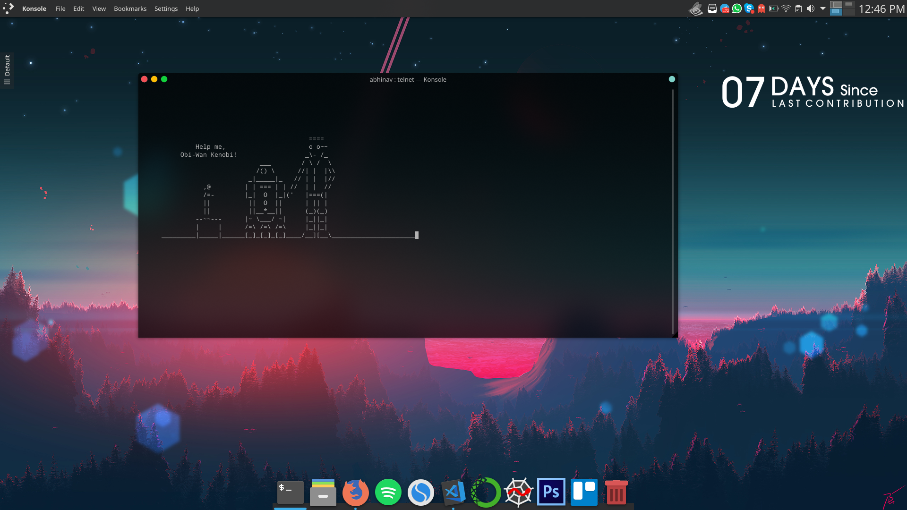

# [Conky] Github Activity Status

 

Conky theme that shows the number of days since the last contribution in GitHub. A contribution can anything from issues, pull requests & commits

## Install guide

Download

	wget -O github_activity https://github.com/abhinavms/conky-github-activity/archive/master.zip

Unzip and copy/move to .conky dir
    
    unzip github_activity
    mv conky-github-activity-master ~/.conky/github_activity

Install used fonts from spoclo/fonts
    
    cd ~/.conky/github_activity/fonts
    ./install.sh

**Important:** Change the variable username (Line No- 38 on script.py) to your GitHub username.
    
Run conky with custom config
    
    conky -c ~/.conky/github_activity/conkyrc_github
    
> **Note:**  
>Alternative: Copy content of conkyrc_github into **~/.conkyrc** file and copy script.py also to another location and update the execi path of the .py file within the conkyrc and run conky without any parameter.
>
>AutoStartup: If you have issue running conky on startup with conky -c ~/.conky/github_activity/conkyrc_github, then set conky-startup.sh to execute on startup
